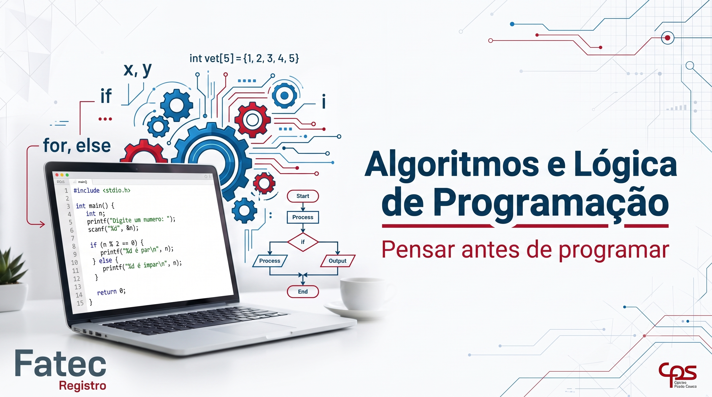
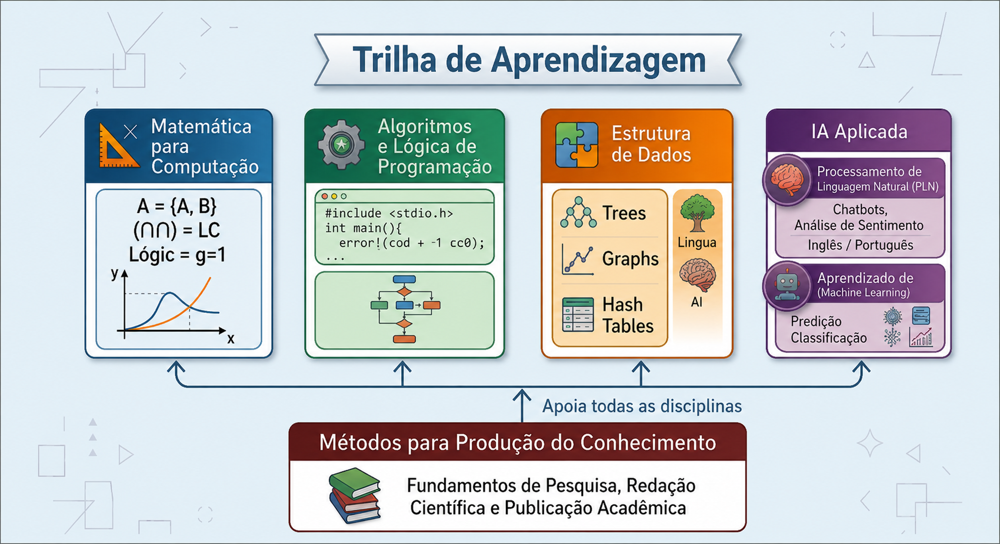

# Bem-vindo(a)!

Esta disciplina apresenta os fundamentos da construção de algoritmos e da lógica de programação, desenvolvendo o raciocínio lógico e a capacidade de resolver problemas utilizando a linguagem <b>C</b>. Ao longo do semestre serão abordados conceitos essenciais para a formação do desenvolvedor de software, servindo como base para as demais disciplinas do curso de Desenvolvimento de Software Multiplataforma.

!!! danger "COMPETÊNCIAS A SEREM DESENVOLVIDAS"

    Ao concluir esta disciplina, espera-se que o estudante seja capaz de:
    
    - Interpretar problemas computacionais.
    - Desenvolver algoritmos utilizando pseudocódigo.
    - Implementar soluções utilizando a linguagem C.
    - Utilizar estruturas condicionais e de repetição.
    - Modularizar programas por meio de funções.
    - Trabalhar com vetores e matrizes.
    - Aplicar boas práticas de programação.

## 📌 Painel da Disciplina

- :material-file-document-outline: [Plano de ensino](plano-de-ensino.md)
    
    Objetivos, competências, metodologia e critérios de avaliação.
    
- :material-calendar-month: [Cronograma](cronograma.md)

    Organização semanal das aulas e conteúdos.

- :material-book-open-page-variant: [Materiais](materiais.md)

    Slides, códigos, vídeos e materiais de apoio.

- :material-pencil: [Exercicios](exercicios.md)

    Listas de exercícios, desafios e atividades práticas.

- :material-clipboard-check-outline: [Avaliações](avaliacoes.md)

    Critérios, datas e orientações das avaliações.

- :material-lightbulb-on-outline: [Projetos](projetos.md)

    Projetos práticos desenvolvidos durante o semestre.

- :material-bookshelf: [Bibliografia](bibliografia.md)

    Livros e referências recomendadas.

- :material-bullhorn-outline: [Avisos](avisos.md)

    Comunicados importantes da disciplina.

- :material-github: [Repositório GitHub](#)

    Códigos-fonte, exemplos e materiais.

- :material-web: [GitHub Pages](#)

    Portal da disciplina.

## 📈 Trilha de Aprendizagem

Esta disciplina faz parte da trilha de formação em Computação.

